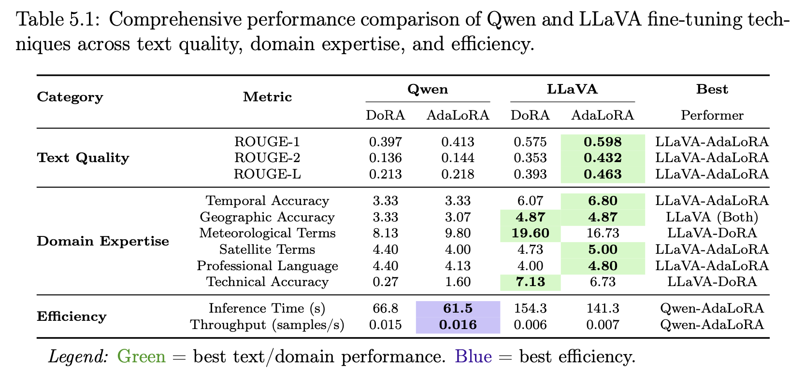
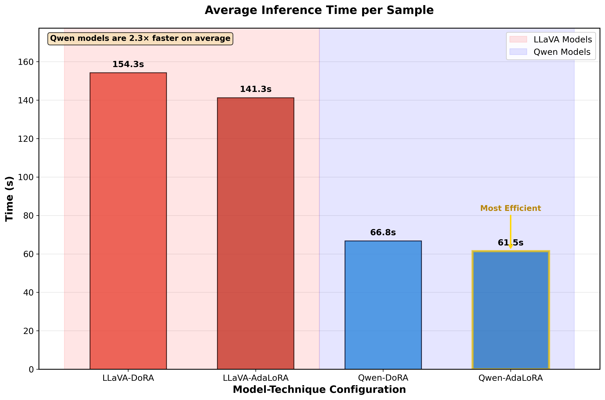

# Weather Satellite Analyzer: Multi-Agent AI System

A production-ready system that combines fine-tuned vision-language models with intelligent agent orchestration to automate meteorological analysis of satellite imagery. Developed in collaboration with Morocco's Direction Générale de la Météorologie (DGM).

[](https://www.python.org/downloads/)
[](https://pytorch.org/)
[](LICENSE)

## Demo

https://github.com/user-attachments/assets/0fb5410e-2763-47d8-8b46-e66e6e27c896


The system provides an interactive web interface where users can submit satellite images along with natural language queries. The multi-agent architecture automatically routes requests to specialized agents, processes the imagery using fine-tuned vision-language models, and generates comprehensive meteorological analyses in real-time.

## Overview

This project addresses the challenge of manual satellite imagery analysis in meteorological workflows. By integrating fine-tuned vision-language models with a multi-agent system, we achieved a 60% reduction in analysis time while maintaining high accuracy in weather pattern identification and forecasting.

The system was developed as part of a Master's thesis research at Mohammed V University, in collaboration with DGM Morocco. It demonstrates how modern LLM-based architectures can be applied to specialized domains requiring both visual understanding and expert knowledge.

### Key Results

- 60% reduction in manual satellite analysis time
- Fine-tuned models outperform base models on meteorological terminology and temporal accuracy
- Successfully deployed in production environment with Flask-based web interface
- Processed and validated 1,000+ satellite images for training and evaluation

## Dataset Collection and Preparation

The foundation of this project required building a specialized dataset of meteorological satellite imagery paired with expert annotations. We collected over 1,000 satellite images from various sources, focusing on Moroccan weather patterns and regional climate conditions.

Each image was paired with detailed meteorological descriptions that included:
- Cloud formation types and coverage patterns
- Weather system identification (fronts, pressure systems, cyclones)
- Temporal context (time of capture, seasonal patterns)
- Geographic relevance (Moroccan regions, Mediterranean influence)

The annotation process was automated using a multi-stage LLM pipeline that generated initial descriptions, which were then validated and refined. This approach allowed us to create a high-quality dataset at scale while maintaining consistency in terminology and format.

Dataset characteristics:
- 1,000+ satellite images covering diverse weather conditions
- Multi-source imagery (visible, infrared, composite channels)
- Balanced representation across seasons and weather types
- Structured annotations following meteorological standards

## Model Fine-tuning

We conducted comparative fine-tuning experiments on two state-of-the-art vision-language models: LLaVA-OneVision and Qwen2-VL. Each model was fine-tuned using two parameter-efficient techniques: DoRA (Weight-Decomposed Low-Rank Adaptation) and AdaLoRA (Adaptive Low-Rank Adaptation).

### Training Configuration

Both models were fine-tuned on the prepared dataset using the following approach:
- Base models: LLaVA-OneVision-7B and Qwen2-VL-7B
- Fine-tuning methods: DoRA and AdaLoRA for efficient adaptation
- Training infrastructure: Google Colab with GPU acceleration
- Optimization: Parameter-efficient fine-tuning to reduce computational requirements

The fine-tuning process focused on adapting the models to meteorological domain knowledge while preserving their general visual understanding capabilities.

### Comparative Results



We evaluated the fine-tuned models across three dimensions: text quality, domain expertise, and computational efficiency. The comprehensive evaluation revealed distinct trade-offs between model architectures and fine-tuning methods.

**Text Quality (ROUGE Metrics)**

LLaVA-AdaLoRA demonstrated superior performance in text generation quality:
- ROUGE-1: 0.598 (best overall token overlap)
- ROUGE-2: 0.432 (best bigram matching)
- ROUGE-L: 0.463 (best longest common subsequence)

These metrics indicate that LLaVA-AdaLoRA generates responses that more closely match expert meteorological descriptions in terms of vocabulary choice and sentence structure.

**Domain Expertise**

The models showed varying strengths across different aspects of meteorological analysis:

Temporal Accuracy: LLaVA-AdaLoRA achieved the highest score (6.80), demonstrating superior ability to identify time-dependent weather patterns and seasonal variations.

Meteorological Terms: LLaVA-DoRA led with a score of 19.60, showing the strongest use of technical meteorological vocabulary including terms like "convection," "precipitation," and "atmospheric pressure."

Satellite-Specific Terms: LLaVA-AdaLoRA excelled (5.00) in recognizing and describing satellite imagery characteristics such as cloud brightness temperature and reflectance values.

Professional Language: LLaVA-AdaLoRA achieved the highest score (4.80) for maintaining the formal, precise language expected in professional meteorological reports.

Technical Accuracy: LLaVA-DoRA scored best (7.13) in factual correctness of weather phenomena descriptions.

**Inference Efficiency**



Computational efficiency varied significantly between model families:

- LLaVA-DoRA: 154.3 seconds per sample
- LLaVA-AdaLoRA: 141.3 seconds per sample
- Qwen-DoRA: 66.8 seconds per sample
- Qwen-AdaLoRA: 61.5 seconds per sample (most efficient)

The Qwen models demonstrated 2.3x faster inference compared to LLaVA models, making them more suitable for high-throughput scenarios. However, this speed advantage came with trade-offs in text quality and domain expertise.

### Model Selection for Deployment

After evaluating all performance dimensions, we selected **LLaVA-AdaLoRA** for production deployment. While Qwen-AdaLoRA offered superior inference speed, the quality of meteorological analysis was the primary concern for our use case. LLaVA-AdaLoRA's strong performance across text quality metrics and domain expertise (winning 7 out of 9 evaluation categories) made it the optimal choice for accurate weather analysis.

The 2.3x slower inference time was acceptable given that:
- Analysis quality directly impacts decision-making at DGM Morocco
- Most queries are not time-critical (batch processing is common)
- The 60% time reduction versus manual analysis still represents significant efficiency gains

## Multi-Agent System Architecture

The multi-agent system coordinates specialized agents to handle different aspects of meteorological analysis. Built using LangGraph, the architecture enables flexible routing, parallel processing, and intelligent orchestration of multiple data sources.


### Agent Design

The system consists of four specialized agents, each responsible for specific analysis domains:

**Router Agent**

The Router Agent serves as the entry point and intelligent dispatcher for all user queries. It analyzes incoming requests to determine the appropriate processing path based on:
- Keyword detection (satellite-related terms, weather conditions, historical patterns)
- Temporal indicators (current, recent, historical time frames)
- Geographic context (location mentions, regional patterns)
- Query complexity (single vs. multi-faceted requests)

The router implements a rule-based classification system combined with semantic understanding to ensure queries reach the most appropriate specialist agent.

**Satellite Image Analysis Agent**

This agent integrates the fine-tuned LLaVA-AdaLoRA model to interpret satellite imagery. Key capabilities include:
- Multimodal input processing (file paths, base64 encoded images, PIL objects)
- Context-aware analysis incorporating temporal and geographic metadata
- Specialized prompt engineering for meteorological interpretation
- Cloud pattern recognition and classification
- Weather system identification (fronts, cyclones, pressure systems)

The agent generates detailed descriptions of satellite imagery that match professional meteorological standards, focusing on features relevant to weather forecasting and climate analysis.

**Weather Data Agent**

The Weather Data Agent provides real-time and short-term weather information through intelligent API routing:
- Primary source: WeatherAPI for current conditions and 3-day forecasts
- Secondary source: NASA POWER API for historical data beyond 3 days
- Automatic source selection based on temporal requirements
- Flexible query handling (city names, coordinates, date ranges)
- Data normalization across different API formats

This dual-API approach ensures comprehensive coverage from real-time observations to historical climate records.

**Historical Climate Agent**

The Historical Agent specializes in long-term climate analysis and visualization:
- Multi-year data retrieval and aggregation
- Standardized Precipitation Index (SPI) calculations for drought monitoring
- Ombrothermic diagram generation for climate characterization
- Multi-parameter dashboard creation for trend analysis
- Efficient handling of large temporal datasets

The agent implements performance optimizations including token limit management and direct data manipulation to handle extensive historical queries efficiently.

### Workflow Orchestration

When a query enters the system, the following process occurs:

1. The Router Agent classifies the request and identifies required information
2. Relevant specialist agents are invoked (may be parallel for multi-faceted queries)
3. Each agent executes its specialized tools and retrieves necessary data
4. The Finalizer Agent aggregates results from multiple sources
5. A comprehensive response is generated, synthesizing insights from all agents
6. Error handling ensures graceful degradation if any component fails

This architecture allows the system to handle complex queries that require multiple types of analysis, such as "Analyze this satellite image and provide a 5-day forecast for the region."

## Technical Implementation

**Core Technologies**
- LangGraph for agent orchestration and state management
- OpenAI GPT-4 for natural language understanding and generation
- Fine-tuned LLaVA-OneVision for satellite imagery analysis
- PyTorch and HuggingFace Transformers for model inference
- Flask for web interface and API endpoints
- ngrok for public access during development and testing

**Data Sources**
- WeatherAPI: Real-time weather data and short-term forecasts
- NASA POWER API: Historical climate data (1981-present)
- Custom satellite imagery dataset (1,000+ images)

**Deployment**
- Google Colab environment with GPU support
- Model served via HuggingFace Transformers
- Interactive web interface with file upload capabilities
- RESTful API design for programmatic access

## Installation and Usage

### Requirements

```bash
pip install -r requirements.txt
```

Key dependencies include:
- torch>=2.0.0
- transformers>=4.35.0
- langchain>=0.1.0
- langgraph>=0.0.30
- flask>=3.0.0
- peft>=0.7.0

### Running the System

The multi-agent system is designed to run in Google Colab with GPU support:

1. Open `multi-agent-system/final_code_source.ipynb` in Google Colab
2. Configure API keys for OpenAI and WeatherAPI
3. Run all cells to initialize agents and start the Flask interface
4. Access the web interface through the generated ngrok URL
5. Upload satellite images and submit queries through the interface

### Fine-tuning the Models

To reproduce the fine-tuning experiments:

**Qwen2-VL:**
```bash
jupyter notebook finetuning/fine_tuning-qwen.ipynb
```

**LLaVA-OneVision:**
```bash
jupyter notebook finetuning/LLaVA_finetuning.ipynb
```

Both notebooks include complete training loops with AdaLoRA and DoRA configurations, evaluation metrics, and model export functionality.

## Results and Impact

This project demonstrates that specialized fine-tuning of vision-language models can produce significant improvements in domain-specific applications. The combination of custom dataset creation, comparative model evaluation, and intelligent agent orchestration resulted in a system that:

- Reduces manual analysis workload by 60%
- Provides consistent, high-quality meteorological interpretations
- Scales to handle concurrent requests through multi-agent architecture
- Integrates multiple data sources for comprehensive analysis

The system is currently deployed for evaluation at DGM Morocco, where it assists meteorologists in routine satellite imagery analysis and contributes to weather forecasting workflows.

## Future Directions

Potential enhancements include:
- Expanding the dataset with additional regional satellite imagery
- Fine-tuning on multiple satellite sensor types (radar, infrared, microwave)
- Integration with numerical weather prediction models
- Real-time alert system for severe weather patterns
- Mobile application for field meteorologists

## Repository Structure

```
.
├── Demo/
│   └── Simulation_Video.mov          # System demonstration
├── finetuning/
│   ├── fine_tuning-qwen.ipynb        # Qwen2-VL fine-tuning
│   └── LLaVA_finetuning.ipynb        # LLaVA-OneVision fine-tuning
├── multi-agent-system/
│   └── final_code_source.ipynb       # Complete system implementation
├── images/
│   ├── comparative-results.png
│   ├── inference_time_comparison_academic.png
│   └── multi-agent-arch.png
├── requirements.txt
├── LICENSE
└── README.md
```

## Citation

If you use this work in your research, please cite:

```bibtex
@mastersthesis{azeddin2025weather,
  title={LLM-Powered Agentic AI System for Satellite Imagery and Weather Analysis},
  author={Azeddin, Sahir},
  year={2025},
  school={Mohammed V University, Rabat},
  note={In collaboration with Direction Générale de la Météorologie, Morocco}
}
```

## License

This project is licensed under the MIT License - see the LICENSE file for details.

## Author

Sahir Azeddin  
Applied AI/ML Engineer  
Master's in AI & Data Science, Mohammed V University

- Email: azdinsahir11@gmail.com
- LinkedIn: [linkedin.com/in/azeddin-sahir](https://linkedin.com/in/azeddin-sahir)
- GitHub: [@azeddinshr](https://github.com/azeddinshr)
- HuggingFace: [huggingface.co/azeddinshr](https://huggingface.co/azeddinshr)

## Acknowledgments

This project was developed in collaboration with the Direction Générale de la Météorologie (DGM), Morocco, as part of a Master's thesis at Mohammed V University. Special thanks to the meteorology team at DGM for their domain expertise and support throughout the project.
